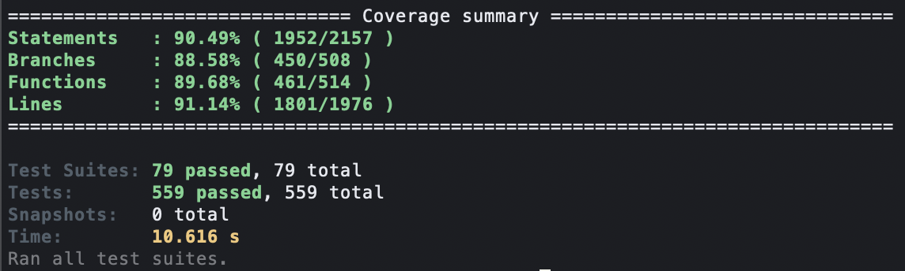
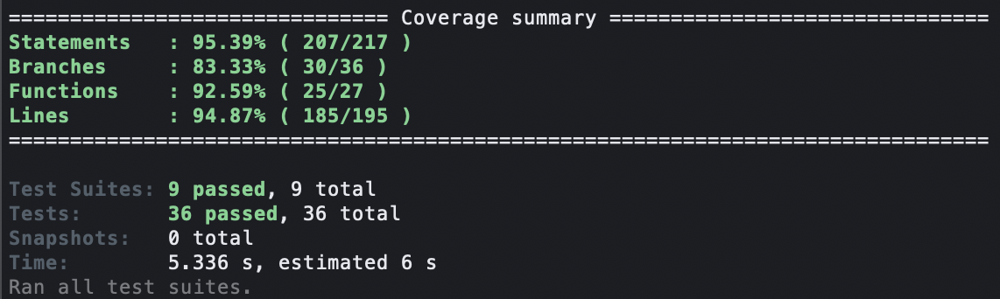
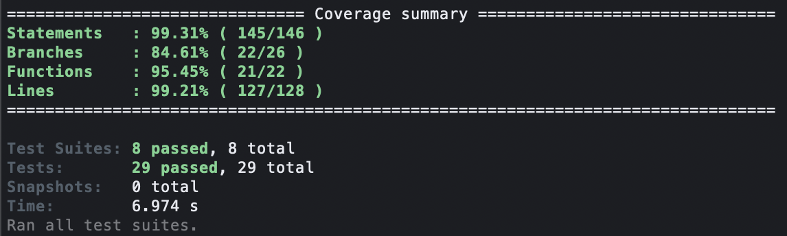

# Oficina Mecânica — Infraestrutura Kubernetes (Fase 4)

Infraestrutura AWS com K3s e Kong Gateway para arquitetura de microsserviços com Saga Pattern. Este README é o ponto de partida para rodar o projeto completo da Fase 4.

## 📋 Índice

- [🔗 Links Úteis](#-links-úteis)
- [🎯 Arquitetura](#-arquitetura)
- [🛠️ Tecnologias](#️-tecnologias)
- [🚀 Provisionamento e Deploy](#-provisionamento-e-deploy-completo)
- [📊 Microsserviços](#-microsserviços)
- [🔄 Saga Pattern](#-saga-pattern)
- [💳 Integração Mercado Pago](#-integração-mercado-pago)
- [🔐 Autenticação JWT](#-autenticação-jwt)
- [⚙️ Comandos Essenciais](#️-comandos-essenciais)
- [🧪 Testes e Qualidade](#-testes-e-qualidade)
- [🔧 CI/CD](#-cicd)
- [📝 Licença](#-licença)

## 🔗 Links Úteis

### Repositórios da Fase 4

#### Microsserviços
- [12soat-oficina-os-service](https://github.com/cassiamartinelli-fc/12soat-oficina-os-service) — Gestão de Ordens de Serviço
- [12soat-oficina-billing-service](https://github.com/cassiamartinelli-fc/12soat-oficina-billing-service) — Orçamento e Pagamento
- [12soat-oficina-production-service](https://github.com/cassiamartinelli-fc/12soat-oficina-production-service) — Execução e Produção

#### Infraestrutura
- [12soat-oficina-infra-k8s](https://github.com/cassiamartinelli-fc/12soat-oficina-infra-k8s) — Infraestrutura Kubernetes (este repositório)
- [12soat-oficina-lambda-auth](https://github.com/cassiamartinelli-fc/12soat-oficina-lambda-auth) — Lambda de Autenticação JWT

### Deploy Ativo
- **Kong Gateway:** Execute workflow `Terraform AWS` → `output` para obter `<KONG_URL>`
- **API Docs:** `<KONG_URL>/{service-name}/api-docs`
- **Health Check:** `<KONG_URL>/{service-name}/health`
- **New Relic APM:** https://one.newrelic.com

### Documentação
- **Vídeo Demonstração Fase 4:** [Em breve]
- **Postman Collections:** [Oficina Mecânica API](https://www.postman.com/cassia-martinelli-9397607/workspace/cassia-s-workspace/request/46977418-4a758cc9-d08a-4ca6-ab97-b522149755d5?action=share&creator=46977418&ctx=documentation)
- **Arquitetura Completa:** Ver seção [Arquitetura](#-arquitetura-da-fase-4)

## 🎯 Arquitetura

### Visão Geral

```
┌─────────────┐
│   Cliente   │
└──────┬──────┘
       │ HTTPS
       ▼
┌────────────────────────────────────────┐
│         AWS Lambda Auth                │
│  (Geração de Token JWT)                │
└────────────────────────────────────────┘
       │
       ▼
┌────────────────────────────────────────┐
│         Kong Gateway (EC2)             │
│  - Validação JWT                       │
│  - Roteamento de Serviços              │
│  - NodePort :30080                     │
└──────┬─────────────┬──────────┬────────┘
       │             │          │
       ▼             ▼          ▼
┌──────────────┐ ┌──────────────┐ ┌──────────────┐
│ OS Service   │ │ Billing Svc  │ │Production Svc│
│ (Port 3000)  │ │ (Port 3001)  │ │ (Port 3002)  │
│              │ │              │ │              │
│ MongoDB      │ │ PostgreSQL   │ │ PostgreSQL   │
│ (NoSQL)      │ │ (SQL)        │ │ (SQL)        │
└──────┬───────┘ └──────┬───────┘ └──────┬───────┘
       │                │                │
       └────────────────┴────────────────┘
                     │
                     ▼
              ┌──────────────┐
              │   AWS SQS    │
              │ (Mensageria) │
              └──────────────┘
                     │
                     ▼
              ┌───────────────┐
              │  New Relic    │
              │(Observability)│
              └───────────────┘
```

### Diagrama da Arquitetura

[Diagrama da Arquitetura](https://github.com/cassiamartinelli-fc/12soat-oficina-infra-k8s/blob/main/arquitetura_diagrama.pdf)

### Decisões Arquiteturais

**Divisão de Microsserviços:**
- **OS Service:** Gerencia ciclo de vida das ordens de serviço (abertura, status, histórico)
- **Billing Service:** Responsável por orçamentos, integração Mercado Pago e pagamentos
- **Production Service:** Controla fila de execução

**Justificativa:** Separação clara de responsabilidades seguindo domínios de negócio independentes, permitindo escalabilidade e deploy isolado.

## 🛠️ Tecnologias

### Infraestrutura
- **AWS EC2 t3.small** — Instância Ubuntu 22.04
- **K3s** — Kubernetes single-node (leve, produtivo)
- **Kong Gateway** — API Gateway com JWT (modo declarativo)
- **Terraform** — IaC com estado remoto S3
- **SQS** — Serviço de fila para comunicação assíncrona

### Microsserviços
- **NestJS** — Framework Node.js com TypeScript
- **MongoDB** — Banco NoSQL (OS Service)
- **PostgreSQL (Neon)** — Banco SQL gerenciado (Billing e Production)
- **TypeORM** — ORM para PostgreSQL
- **Mongoose** — ODM para MongoDB
- **New Relic** — APM e observabilidade

## 🚀 Provisionamento e Deploy Completo

### Pré-requisitos

- Conta AWS com credenciais configuradas
- Secrets configurados em cada repositório (detalhes abaixo)
- Chave SSH `oficina-key` criada no AWS EC2 Console (região us-east-1)

### Passo 1: Provisionar Infraestrutura Kubernetes

**Repositório:** [12soat-oficina-infra-k8s](https://github.com/cassiamartinelli-fc/12soat-oficina-infra-k8s)

1.1. Executar workflow `Terraform AWS` → `apply` (aguardar ~3 min)

1.2. Obter informações da infraestrutura:
```bash
# Consulte o Summary do workflow: Terraform AWS → apply
# Ou execute workflow: Terraform AWS → output
# Ou via terraform local:
cd terraform
terraform output kong_url
terraform output public_ip
```

1.3. Obter kubeconfig para deploy dos serviços:
```bash
ssh -i ~/.ssh/oficina-key.pem ubuntu@<PUBLIC_IP> 'cat /home/ubuntu/.kube/config'
```

1.4. Salvar kubeconfig como secret `KUBECONFIG` nos 3 repositórios de microsserviços.

**Secrets necessários (Settings → Secrets → Actions):**
- `AWS_ACCESS_KEY_ID` — AWS Access Key
- `AWS_SECRET_ACCESS_KEY` — AWS Secret Key
- `JWT_SECRET` — Chave secreta para validação JWT

### Passo 2: Deploy dos Microsserviços

**IMPORTANTE:** Seguir ordem de deploy para garantir dependências.

#### 2.1. OS Service
**Repositório:** [12soat-oficina-os-service](https://github.com/cassiamartinelli-fc/12soat-oficina-os-service)

```bash
# Execute workflow: CI/CD - OS Service
```

**Secrets necessários:**
- `AWS_ACCESS_KEY_ID`: AWS Access Key
- `AWS_SECRET_ACCESS_KEY`: AWS Secret Key
- `KUBECONFIG`: Obtido no Passo 1.3
- `OS_DATABASE_URL`: Connection string PostgreSQL (Neon)
- `SONAR_TOKEN`:  Token do Sonar
- `SQS_BILLING_QUEUE_URL`: URL da fila SQS de Billing Service
- `SQS_OS_QUEUE_URL`: URL da fila SQS de OS Service
- `NEW_RELIC_LICENSE_KEY`: License key New Relic

#### 2.2. Billing Service
**Repositório:** [12soat-oficina-billing-service](https://github.com/cassiamartinelli-fc/12soat-oficina-billing-service)

```bash
# Execute workflow: CI/CD - Billing Service
```

**Secrets necessários:**
- `AWS_ACCESS_KEY_ID` — AWS Access Key
- `AWS_SECRET_ACCESS_KEY` — AWS Secret Key
- `KUBECONFIG` — Obtido no Passo 1.3
- `MONGODB_URI` — Connection string MongoDB Atlas
- `SONAR_TOKEN`:  Token do Sonar
- `SQS_BILLING_QUEUE_URL`: URL da fila SQS de Billing Service
- `SQS_OS_QUEUE_URL`: URL da fila SQS de OS Service
- `SQS_PRODUCTION_QUEUE_URL`: URL da fila SQS de OS Production
- `MERCADO_PAGO_ACCESS_TOKEN`: Token de acesso Mercado Pago
- `NEW_RELIC_LICENSE_KEY`: License key New Relic

#### 2.3. Production Service
**Repositório:** [12soat-oficina-production-service](https://github.com/cassiamartinelli-fc/12soat-oficina-production-service)

```bash
# Execute workflow: CI/CD - Production Service
```

**Secrets necessários:**
- `AWS_ACCESS_KEY_ID` — AWS Access Key
- `AWS_SECRET_ACCESS_KEY` — AWS Secret Key
- `DATABASE_URL`: Connection string PostgreSQL (Neon)
- `KUBECONFIG` — Obtido no Passo 1.3
- `SONAR_TOKEN`:  Token do Sonar
- `SQS_OS_QUEUE_URL`: URL da fila SQS de OS Service
- `SQS_PRODUCTION_QUEUE_URL`: URL da fila SQS de OS Production
- `NEON_DATABASE_URL` — Connection string PostgreSQL (Neon)
- `RABBITMQ_URL` — URL do RabbitMQ (mesma dos outros serviços)
- `NEW_RELIC_LICENSE_KEY` — License key New Relic

### Passo 3: Deploy Lambda de Autenticação

**Repositório:** [12soat-oficina-lambda-auth](https://github.com/cassiamartinelli-fc/12soat-oficina-lambda-auth)

```bash
# Execute workflow: CD - Deploy Lambda to AWS
```

**Secrets necessários:**
- `AWS_ACCESS_KEY_ID`: AWS Access Key
- `AWS_SECRET_ACCESS_KEY`: AWS Secret Key
- `NEON_DATABASE_URL`: Connection string PostgreSQL (Neon)
- `JWT_SECRET`: Mesma chave usada na infraestrutura

### Passo 4: Validação do Deploy

```bash
# Substituir <KONG_URL> pela URL obtida no Passo 1.2

# Health check dos serviços
curl <KONG_URL>/os-service/health
curl <KONG_URL>/billing-service/health
curl <KONG_URL>/production-service/health

# Validar Kong Gateway
curl <KONG_URL>
```

## 📊 Microsserviços

### OS Service (Ordem de Serviço)

**Responsabilidades:**
- Abertura de ordens de serviço
- Atualização de status
- Consulta de status e histórico
- Orquestração do fluxo Saga

**Banco de Dados:** PostgreSQL (SQL)

**Endpoints principais:**
- `POST /ordens-servico` — Criar OS (inicia Saga)
- `GET /ordens-servico` — Listar OS
- `GET /ordens-servico/:id` — Obter OS por ID
- `PATCH /ordens-servico/:id/status` — Atualizar status

**Eventos publicados:**
- `os.criada` — OS criada com sucesso
- `os.cancelada` — OS cancelada (compensação)

### Billing Service (Orçamento e Pagamento)

**Responsabilidades:**
- Geração de orçamentos
- Envio para aprovação do cliente
- Integração com Mercado Pago
- Registro e verificação de pagamentos
- Atualização de status da OS após pagamento

**Banco de Dados:** MongoDB (NoSQL)

**Endpoints principais:**
- `POST /orcamentos` — Criar orçamento
- `GET /orcamentos/:osId` — Obter orçamento por OS
- `POST /pagamentos/webhook` — Webhook Mercado Pago
- `GET /pagamentos/:osId` — Verificar status pagamento

**Eventos consumidos:**
- `os.criada` — Gera orçamento automaticamente

**Eventos publicados:**
- `orcamento.criado` — Orçamento gerado
- `pagamento.aprovado` — Pagamento confirmado
- `pagamento.recusado` — Pagamento recusado (compensação)

### Production Service (Execução e Produção)

**Responsabilidades:**
- Gerenciar fila de execução
- Atualizar status durante diagnóstico
- Controlar execução
- Comunicar finalização ao OS Service

**Banco de Dados:** PostgreSQL (SQL)

**Endpoints principais:**
- `POST /execucoes` — Iniciar execução
- `GET /execucoes/fila` — Obter fila de execução
- `PATCH /execucoes/:id/status` — Atualizar status execução
- `POST /execucoes/:id/finalizar` — Finalizar execução

**Eventos consumidos:**
- `pagamento.aprovado` — Inicia execução da OS

**Eventos publicados:**
- `execucao.iniciada` — Execução iniciada
- `execucao.finalizada` — Serviço concluído
- `execucao.falhada` — Erro na execução (compensação)

### Regra de Isolamento

**Nenhum serviço acessa diretamente o banco de outro.** Toda comunicação ocorre via:
- APIs REST (síncronas)
- Mensageria AWS SQS (assíncronas)

## 🔄 Saga Pattern

### Estratégia: Orquestração

**Justificativa:**
- Fluxo complexo com múltiplas etapas sequenciais
- Necessidade de controle centralizado de compensações
- Facilita rastreamento e debugging
- Menor complexidade em comparação à coreografia para este cenário

### Orquestrador

O **OS Service** atua como orquestrador central, coordenando o fluxo:

1. Cliente cria OS → OS Service  
2. OS Service publica **OS_CRIADA**  
3. Billing Service consome e gera orçamento (nenhum evento é publicado)  
4. Cliente aprova e paga → Billing Service publica **ORCAMENTO_APROVADO**  
5. Production Service consome ORCAMENTO_APROVADO e publica **EXECUCAO_INICIADA**  
6. Production Service, ao terminar, publica **EXECUCAO_FINALIZADA**  
7. OS Service consome EXECUCAO_FINALIZADA e atualiza status para `FINALIZADA`

### Fluxo de Compensação

**Cenário 1: Pagamento Recusado**
```
1. Billing Service detecta falha no pagamento
2. Publica evento ORCAMENTO_CANCELADO
3. OS Service consome e atualiza status para CANCELADA
4. Production Service ignora (não iniciou execução)
```

**Cenário 2: Cliente Rejeita Orçamento**
```
1. Billing Service registra rejeição
2. Publica evento FALHA_EXECUCAO
3. OS Service atualiza status para CANCELADA
4. Nenhum pagamento é processado
```

## 💳 Integração Mercado Pago

**Implementação no Billing Service:**

### Fluxo de Pagamento

1. Cliente aprova orçamento
2. Billing Service cria preferência de pagamento no Mercado Pago
3. Cliente é redirecionado para checkout Mercado Pago
4. Mercado Pago processa pagamento
5. Webhook notifica Billing Service
6. Billing Service valida pagamento e publica `pagamento.aprovado`

### Configuração

**Variável de ambiente:**
```bash
MERCADO_PAGO_ACCESS_TOKEN=APP_USR-xxxxx
```

**Endpoint de webhook:**
```
POST <KONG_URL>/billing-service/pagamentos/webhook
```

**Documentação oficial:** https://www.mercadopago.com.br/developers/pt/docs

## 🔐 Autenticação JWT

### Fluxo de Autenticação

1. Cliente envia CPF para Lambda Auth
2. Lambda valida CPF no banco de clientes
3. Lambda gera token JWT assinado com `JWT_SECRET`
4. Cliente usa token no header `Authorization: Bearer <token>`
5. Kong Gateway valida token antes de rotear para serviços

### Rotas Públicas (GET)

- `GET /os-service/*` — Consultas de OS
- `GET /billing-service/*` — Consultas de orçamentos
- `GET /production-service/*` — Consultas de execução

### Rotas Protegidas (POST, PUT, PATCH, DELETE)

**Requerem token JWT válido:**
- `POST /os-service/ordens-servico` — Criar OS
- `PATCH /os-service/ordens-servico/:id` — Atualizar OS
- `POST /billing-service/orcamentos` — Criar orçamento
- `PATCH /production-service/execucoes/:id` — Atualizar execução

### Obter Token JWT

```bash
# Substituir <LAMBDA_URL> pela URL obtida no deploy da Lambda

curl -X POST <LAMBDA_URL> \
  -H "Content-Type: application/json" \
  -d '{"cpf":"12345678900"}'

# Resposta:
# {"token":"eyJhbGciOiJIUzI1NiIsInR5cCI6IkpXVCJ9..."}
```

### Usar Token em Requisições

```bash
TOKEN="eyJhbGciOiJIUzI1NiIsInR5cCI6IkpXVCJ9..."

curl -X POST <KONG_URL>/os-service/ordens-servico \
  -H "Content-Type: application/json" \
  -H "Authorization: Bearer $TOKEN" \
  -d '{
    "clienteId": "123",
    "veiculoId": "456",
    "descricao": "Troca de óleo"
  }'
```

## ⚙️ Comandos Essenciais

### Obter URL da Infraestrutura

```bash
# Via GitHub Actions
# Execute workflow: Terraform AWS → output

# Via Terraform local
cd terraform
terraform output kong_url
terraform output public_ip
```

### Testar Serviços (Rotas Públicas)

```bash
# Substituir <KONG_URL> pela URL obtida

# Health checks
curl <KONG_URL>/os-service/health
curl <KONG_URL>/billing-service/health
curl <KONG_URL>/production-service/health

### Acesso SSH e Logs

```bash
# SSH na instância EC2
ssh -i ~/.ssh/oficina-key.pem ubuntu@<PUBLIC_IP>

# Verificar pods Kubernetes
kubectl get pods

# Logs dos serviços
kubectl logs -f deployment/os-service
kubectl logs -f deployment/billing-service
kubectl logs -f deployment/production-service
kubectl logs -f deployment/kong-gateway
```

### Destruir Infraestrutura

```bash
# Via GitHub Actions
# Execute workflow: Terraform AWS → destroy

# Via Terraform local
cd terraform
terraform destroy -auto-approve
```

## 🧪 Testes e Qualidade

### Cobertura de Testes

**Requisito:** Mínimo 80% de cobertura por serviço

**Verificação:**
```bash
# Em cada repositório de microsserviço
npm run test:cov

# Relatório de cobertura em: coverage/lcov-report/index.html
```

### Testes Unitários

Todos os microsserviços possuem testes unitários para:
- Use cases / serviços
- Repositories
- Controllers
- Validações de domínio

**Executar testes:**
```bash
npm run test
```

### Testes BDD (Behavior-Driven Development)

**Fluxo testado:** Criação de OS com Saga completo

**Cenário:**
```gherkin
Feature: Criação de Ordem de Serviço com Saga

  Scenario: Cliente cria OS e paga com sucesso
    Given um cliente autenticado
    And um veículo cadastrado
    When o cliente cria uma OS
    Then um orçamento é gerado automaticamente
    And o status da OS é AGUARDANDO_APROVACAO
    When o cliente aprova e paga o orçamento
    Then o status da OS muda para EM_EXECUCAO
    And a OS entra na fila de produção
    When a execução é finalizada
    Then o status da OS muda para FINALIZADA

  Scenario: Falha no pagamento (compensação)
    Given uma OS criada com orçamento
    When o pagamento é recusado
    Then o status da OS muda para CANCELADA
    And a execução não é iniciada
```

**Executar testes BDD:**
```bash
# No repositório OS Service
npx cucumber-js
```

### Validação de Qualidade (SonarQube)

**Pipeline CI/CD inclui:**
- Análise estática de código
- Detecção de code smells
- Verificação de duplicação
- Análise de segurança

### Evidências de Cobertura

**Links nos READMEs de cada serviço:**
- OS Service: `coverage/`


- Billing Service: `coverage/`


- Production Service: `coverage/`


## 🔧 CI/CD

### Proteção de Branches

**Todos os repositórios:**
- Branch `main` protegida
- Pull Request obrigatório
- Aprovação mínima: 1 revisor
- Checks automáticos devem passar

### Rollback

**Em caso de falha no deploy:**

```bash
# Via kubectl (com kubeconfig configurado)
kubectl rollout undo deployment/os-service
kubectl rollout undo deployment/billing-service
kubectl rollout undo deployment/production-service

# Verificar status
kubectl rollout status deployment/os-service
```

## 📝 Licença

MIT — Tech Challenge 12SOAT Fase 4
